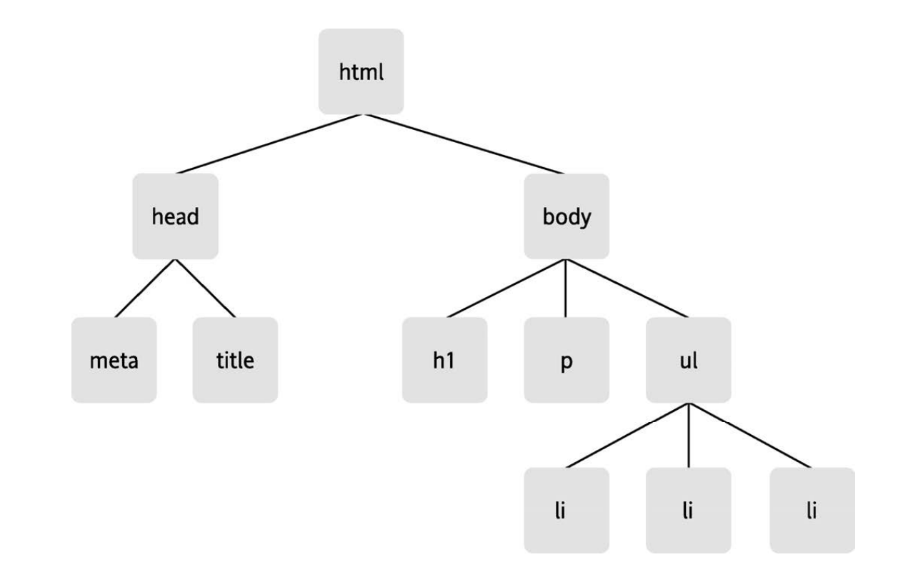

# JavaScript DOM编程艺术 笔记

---

## DOM

### D
document文档

### O

object 对象

JavaScript的对象分为三种
* 用户定义对象（user-defined-object），就是我们自己创建的对象
* 内建对象（native object），JavaScript自带的对象，Array，Math
* 宿主对象（host object），由浏览器提供的对象

### M
Model 模型

DOM把一份文档表示为一棵树，网页中有的元素有父元素，子元素，兄弟元素。

比如说下图：



我们可以将文档的各种元素想象成一颗数，将文档称之为“节点树”

### 节点

节点（node），在DOM中有许多的节点。如上图所示

#### 元素节点

元素节点（element节点）

在上图中`head`是一个节点，`ul`无序列表也是一个节点，`html`也是一个节点，他是节点树的根元素

#### 属性节点

属性节点（attribute node）

属性节点用来对元素做出更具体的描述

**注意：属性是包含在html标签中的`<p id = "xx"></p>`**

#### 文本节点

文本节点（text node）

`<p>就这？</p>`里面的文本“就这”就是一个文本节点

**注意：文本节点是包含在html标签里面的**

### 获取元素

有三种方法可以获取元素节点（element node），分别是通过ID，标签名，类名获取

* document对象特有的函数

#### getElementById

* 语法`document.getElementsById('ID')`
* 返回值：返回一个对象，在document对象中仅有的元素（ID是唯一的）

#### getElementByTagName

* 语法`document.getElementByTagName('tag')`
* 返回值：返回一个对象数组，其中的对象是文档中被选中的标签（具有相同标签名）

小练习：如果只想知道` id `属性值是` purchase `的元素包含着多少个列表项，该如何写

```js
let arr = document.getElementById('purchase').getElementsByTagName('*');

alert(arr.length);

```
tips：`*`是通配符，一点要加上引号，和乘法符号做区别 

#### getElementByClassName

* 语法`document.getElementsByClassName('class')`
* 返回值：具有相同类名元素的数组

### 获取和设置属性

获取和设置属性的方法不属于document，只能用过元素节点对象调用。

#### getAttribute

* 语法`object.getAttribute('属性')`
* 返回值：这个object（元素节点/对象）的属性值

#### setAttribute

* 语法`object.setAttribute('属性', 需要设置的属性值)`
* 如果没有该属性值，那么我们创建一个，如果有该属性值，我们覆盖掉之前的

### 检索和修改文本节点

首先我们要注意到一点，文本节点是**不包含**在元素节点里面的，所以当我们需要修改文本节点的时候，我们要通过元素节点，然后选择元素节点的子节点修改。

#### 获取元素的所有子元素 ——childNodes属性

* 语法：`element.childNodes`
* 返回值：数组

我们要注意的是这个属性所返回的是所有的节点，在文档树中不仅仅包含元素节点，事实上在文档中几乎每一样东西都是一个节点，空格和换行符都会被解释为节点，而他们全都包含在childNodes属性所返回的数组中。

我们可以使用`nodeType`来获取节点的nodetype属性

nodeType 属性总共有 12 种可取值，但其中仅有 3 种具有实用价值。
 元素节点的 nodeType 属性值是 1。
 属性节点的 nodeType 属性值是 2。 
 文本节点的 nodeType 属性值是 3。

#### firstChild和lastChild属性

两个等价写法
`element.childNodes[0] = element.firstChild`
`element.childNodes[element.childNodes.legth - 1] = element.lastChild`

#### 结合childNodes修改文本节点

* `nodeValue`
* 作用：得到或者设置一个节点的值
* 性质：属性

例子：`<p id="description"> Choose on image.</p>`

```js

let description = document.getElelmentById('description');

// 这里取到的值是空值，因为在<p>标签中没有文本元素，文本元素是其子元素
// description.nodeValue;

// 正确写法

// 获取
alert(description.childNodes[0].nodeValue);//choose on image.

// 设置
description.firstChild.nodeValue = 'xxx';


```

---
## JavaScript和HTML代码分离

在上面学习的过程中我们在HTML界面中使用了`onclick()`，这是一个事件处理函数，我们应该将JavaScript代码和HTML代码分离。

### 使用匿名函数调用onclick函数

```js

object.onclick = function (){

    //function body

}

```

当我们点击`object`这个元素节点的时候，我们就会调用后面匿名函数里面的操作

具体demo请看chapter4和chapter6的区别

---

## 共享onload事件

网页在加载完成之后会触发一个onload事件，这个事件与Windows对象相互关联

### onload事件的使用方法

* 将一个函数绑定在onload上
  ```js

    windows.onload = xxx; //xxx为一个函数

  ```

现在我们就将一个函数绑定在了onload上

* 将多个函数绑定在onload上
  ```js

    Windows.onload = function() {
        xxx;//函数
        sss;//函数
    }

  ```

这种方法使用了匿名函数，很方便，不过有个更骚的——addLoadEvent

方法步骤：

1. 把现有的 window.onload 事件处理函数的值存入变量 `oldonload`。
2. 如果在这个处理函数上还没有绑定任何函数，就像平时那样把新函数添加给它。
3. 如果在这个处理函数上已经绑定了一些函数，就把新函数追加到现有指令的末尾。

```js

function addLoadEvent(func) {
    let oldonload = windows.onload();

    if(typeof windows.onload != 'function'){

        windows.onload = func;

    } else {

        wimdows.onload = function () {

            oldonload;
            func;

        }

    }

}

```

在页面加载完毕之后执行的函数创建一个队列，如果还想添加函数进去，我们只需要使用以下代码即可

`addLoadEvent(firstFunction)`

`addLoadEvent(secondFunction)`

## DOM Core 和 HTML-DOM

转载：

> ### 什么是DOM？
>
> DOM （Document Object Model文档对象模型）是 W3C（万维网联盟）的标准。
>
> DOM 定义了访问 HTML 和 XML 文档的标准：
>
> >  “W3C 文档对象模型 （DOM） 是中立于平台和语言的接口，它允许程序和脚本动态地访问和更新文档的内容、结构和样式。”
>
> W3C DOM 标准被分为 3 个不同的部分：
>
> - 核心 DOM - 针对任何结构化文档的标准模型
> - XML DOM - 针对 XML 文档的标准模型
> - HTML DOM - 针对 HTML 文档的标准模型

### 二者的区别

说白了DOM Core是核心，而HTML-DOM是DOM Core的扩展。

HTML——DOM定义了一些方法，使得我们调用DOM更加的方便

等对于DOM Core的写法掌握了以后再学习HTML-DOM，现在学习我怕混淆

